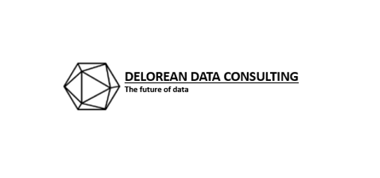
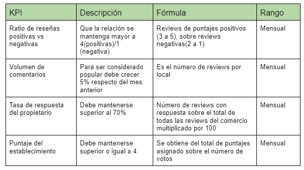
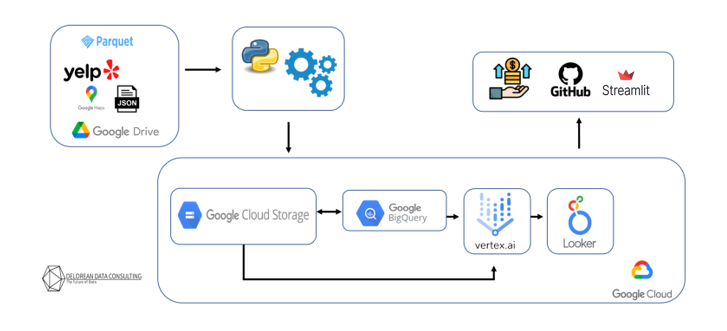
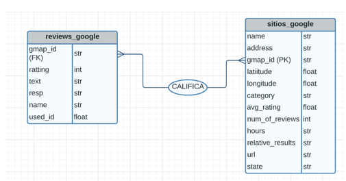
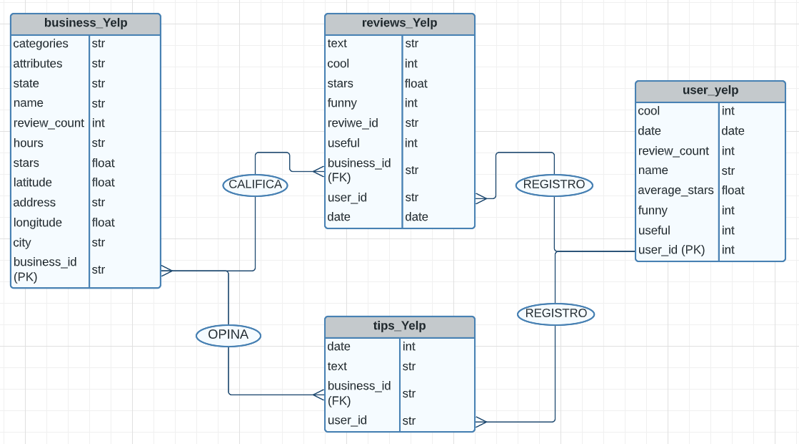
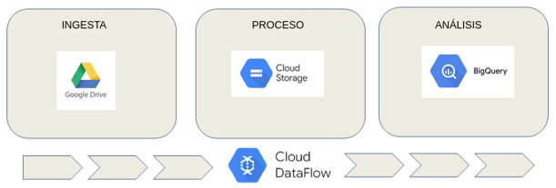

# <h1 align=center> **PROYECTO GRUPAL: Análisis de mercado en base a Google Mapas y Yelp** </h1>
# <h1 align=center> 
# ¿Quienes somos?
# DELOREAN DATA CONSULTING
Somos un grupo de profesionales con amplia experiencia en análisis de datos, procesos empresariales y transformación digital en Latinoamérica. Provenientes de áreas variadas, pero con la misma vocación y pasión por la mejora de procesos de negocio.
# Descripción del proyecto
Como empresa consultora especializada en soluciones data, hemos realizado un análisis exhaustivo utilizando datos de Google Maps y Yelp en Estados Unidos. 
El uso de los datos de estas plataformas es de gran importancia para las empresas que desean obtener información sobre la ubicación geográfica de sus clientes y la percepción que tienen de sus productos o servicios.
Estos datos proporcionan información valiosa sobre la cantidad de negocios cercanos, la cantidad de clientes potenciales y la calidad de los servicios que se ofrecen en la zona.
En este informe, presentaremos un análisis detallado de los datos recopilados de estas plataformas. Discutiremos las principales conclusiones y recomendaciones basadas en nuestros hallazgos, y explicaremos cómo estas conclusiones pueden ayudar a mejorar la toma de decisiones estratégicas en el ámbito empresarial.
#
# Antecedentes
El sector hotelero y gastronómico en Estados Unidos, es un sector en constante crecimiento y altamente competitivo. Según cifras del World Travel & Tourism Council en sus reportes de impacto económico, en 2021, la industria turística generó ingresos por valor de $771.8 mil millones de dólares, de los cuales $40.3 mil millones de dólares correspondieron a visitantes extranjeros , lo que representa un aumento del 21.7% respecto a 2020. Además, Estados Unidos ha sido durante mucho tiempo uno de los destinos turísticos más populares, lo que hace que la elección de la ubicación adecuada para un negocio sea aún más importante.

En este contexto, el uso de datos de Google Maps se ha vuelto cada vez más importante para las empresas que buscan comprender mejor la ubicación geográfica de sus clientes y la percepción que tienen de sus productos o servicios. Los datos de Google Maps proporcionan información valiosa sobre la cantidad de negocios cercanos, la cantidad de clientes potenciales y la calidad de los servicios que se ofrecen en la zona. Estos datos pueden ayudar a identificar tendencias y patrones en la demanda de servicios de hotelería y gastronomía en diferentes áreas geográficas.

En cuanto al contexto económico de la zona, Estados Unidos ha experimentado un fuerte crecimiento en los últimos años y ha sido durante mucho tiempo uno de los principales motores de la economía. La contribución del turismo al PIB nacional para el año 2021 fue de 6.1%, según se indica en los reportes de impacto económico antes mencionados. Además, Estados Unidos posee estados que tienen ubicaciones estratégicas que las convierten en una importante puerta de entrada a América Latina y el Caribe, siendo un destino atractivo para los inversores extranjeros. En resumen, Estados Unidos es un mercado dinámico y en constante evolución que ofrece numerosas oportunidades para las empresas del sector hotelero y gastronómico.

 
 # Objetivos
* Realizar un análisis de sentimiento que permita recomendar a los usuarios según sus intereses entre distintas opciones de hotelería y gastronomía.
* Identificar las zonas geográficas más convenientes para ubicar nuevos locales de hotelería y gastronomía.
* Generar un informe gráfico que muestre el análisis del mercado.
#
# Alcance
* El análisis se centrará en los datos de Google Maps y Yelp recopilados en los 10 estados con mayor turismo extranjero en Estados Unidos.
* Los datos analizados incluirán información sobre la cantidad de negocios cercanos, la cantidad de clientes potenciales y la calidad de los servicios que se ofrecen en la zona.
* Se utilizará un enfoque cuantitativo para analizar los datos recopilados, incluyendo técnicas de análisis de datos estadísticos y de minería de datos.
* El análisis de sentimiento se realizará utilizando herramientas de procesamiento del lenguaje natural para analizar las opiniones y comentarios de los clientes sobre los negocios de hotelería y gastronomía.
* Las recomendaciones estarán basadas en los resultados del análisis de datos y en las mejores prácticas de la industria, pero no se garantiza su éxito en el mercado.
* El informe no considerará factores externos como regulaciones gubernamentales o cambios económicos que puedan afectar la inversión en la zona.
#
# Metodología de trabajo
Utilizaremos un método de trabajo ágil con enfoque en la metodología SCRUM apoyándonos en el software de administración de proyectos Trello, en donde dividiremos y asignaremos las actividades a realizar, actualizaremos nuestro diagrama de Gantt y mantendremos un seguimiento a todo el proyecto. Los pilares de nuestra metodología son:
 * Gestión de trabajo colaborativo a través de la puesta en común de los avances.
 * Resoluciones rápidas y efectivas, reuniones diarias y comunicación fluida.
 * Visualización del flujo de trabajo y división de roles.
 * Simplicidad en las soluciones.
#
# KPIs
# <h1 align=center> 
# Stack tencnológico y Work flow
# <h1 align=center> 
# Diagrama ER
# Diagrama entidad relación Google
# <h1 align=center> 
# Diagrama entidad relación Yelp 
# <h1 align=center> 
# Automatización
La ingesta de los datos no es un proceso que pueda realizarse de manera manual, primero, debido al tamaño de los mismos y segundo por la naturaleza cambiante del origen de los datos.
Por tal motivo se desarrollaron procesos automáticos (canalizaciones) para realizar éstas tareas.

Estas canalizaciones se realizan en dos pasos, la primera, recupera los datos del repositorio original, está considerado, en la etapa de producción realizar una carga incremental en este punto a efecto de mantener actualizada la información. Estos datos se almacenan en una instancia de Google Storage. que definimos como “datalake” ya que almacena los datos crudos, con apenas algún proceso de transformación.

Un segundo proceso de “canalización” se realiza para integrar los datos a una segunda instancia de almacenamiento, en la herramienta google bigQuery.

# <h1 align=center> 

# Entregables
 * Propuesta de proyecto
 * Modelo del almacén de datos
 * Tablero de control con indicadores de desempeño
 * Modelo entrenado del sistema de recomendación
#
# Equipo de trabajo:
+ [Giselle Pereira Nuñez](https://www.linkedin.com/in/giselle-pereira-nu%C3%B1ez-011330168/) - Engineer
+ [Emilio Santander](https://www.linkedin.com/in/emilio-santander/) - Analytics
+ [Facundo Berón](https://www.linkedin.com/in/facundo-beron/) - Scientist
+ [Horacio Morales González](https://www.linkedin.com/in/hmorales1970/) - Engineer/Scientist
+ [Santiago Ibarra](https://www.linkedin.com/in/santiagoibarra-dataanalytics/) - Analytics

