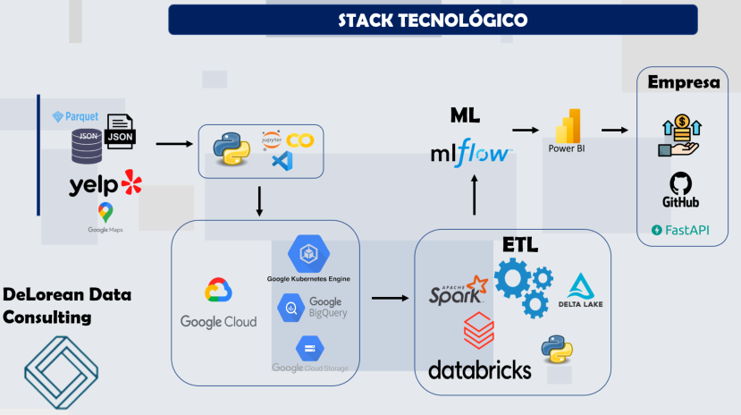

# <h1 align=center> **PROYECTO GRUPAL: Análisis de mercado en base a Google Mapas y Yelp** </h1>
# <h1 align=center> 
# <h1 align=center> 
# Abstracto
Como empresa consultora especializada en soluciones data, hemos realizado un análisis exhaustivo utilizando datos de Google Maps y Yelp en Estados Unidos. 
El uso de los datos de estas plataformas es de gran importancia para las empresas que desean obtener información sobre la ubicación geográfica de sus clientes y la percepción que tienen de sus productos o servicios.
Estos datos proporcionan información valiosa sobre la cantidad de negocios cercanos, la cantidad de clientes potenciales y la calidad de los servicios que se ofrecen en la zona.
En este informe, presentaremos un análisis detallado de los datos recopilados de estas plataformas. Discutiremos las principales conclusiones y recomendaciones basadas en nuestros hallazgos, y explicaremos cómo estas conclusiones pueden ayudar a mejorar la toma de decisiones estratégicas en el ámbito empresarial.
#
 # Objetivos
* Realizar un análisis de sentimiento que permita recomendar a los usuarios según sus intereses entre distintas opciones de hotelería y gastronomía.
* Identificar las zonas geográficas más convenientes para ubicar nuevos locales de hotelería y gastronomía.
* Generar un informe gráfico que muestre el análisis del mercado.
#
# Alcance
* El análisis se centrará en los datos de Google Maps y Yelp recopilados en los 10 estados con mayor turismo extranjero en Estados Unidos.
* Los datos analizados incluirán información sobre la cantidad de negocios cercanos, la cantidad de clientes potenciales y la calidad de los servicios que se ofrecen en la zona.
* Se utilizará un enfoque cuantitativo para analizar los datos recopilados, incluyendo técnicas de análisis de datos estadísticos y de minería de datos.
* El análisis de sentimiento se realizará utilizando herramientas de procesamiento del lenguaje natural para analizar las opiniones y comentarios de los clientes sobre los negocios de hotelería y gastronomía.
* Las recomendaciones estarán basadas en los resultados del análisis de datos y en las mejores prácticas de la industria, pero no se garantiza su éxito en el mercado.
* El informe no considerará factores externos como regulaciones gubernamentales o cambios económicos que puedan afectar la inversión en la zona.
#
# Stack tencnológico
# <h1 align=center> 
# Entregables
 * Propuesta de proyecto
 * Modelo del almacén de datos
 * Tablero de control con indicadores de desempeño
 * Modelo entrenado del sistema de recomendación
#
# Equipo de trabajo:
+ [Giselle Pereira Nuñez](https://www.linkedin.com/in/giselle-pereira-nu%C3%B1ez-011330168/) - Engineer
+ [Emilio Santander](https://www.linkedin.com/in/emilio-santander/) - Analytics
+ [Facundo Berón](https://www.linkedin.com/in/facundo-beron/) - Scientist
+ [Horacio Morales González](https://www.linkedin.com/in/hmorales1970/) - Engineer/Scientist
+ [Santiago Ibarra](https://www.linkedin.com/in/santiagoibarra-dataanalytics/) - Analytics

